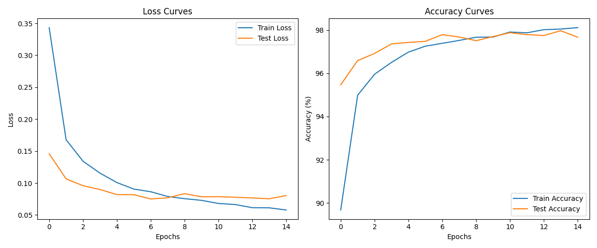

# 实验报告：使用PyTorch搭建FFN实现MNIST数据集分类

## 1. 实验目的与背景

本实验旨在使用PyTorch搭建前馈神经网络（Feed-Forward Network, FFN，也称为多层感知机MLP）实现MNIST手写数字识别任务，并通过系统地调整网络结构和超参数，深入探究不同因素对模型性能的影响。通过本次实验，我期望能够：

1. 熟悉PyTorch深度学习框架的基本使用
2. 理解FFN/MLP网络的基本结构和工作原理
3. 掌握神经网络中关键超参数的调优方法
4. 培养深度学习实验的分析能力和直觉

深度学习中，网络结构和超参数的选择往往依赖于经验和实验。本次实验通过对MNIST这一经典数据集的分类任务，系统性地探索这些因素的影响，有助于我建立对神经网络行为的深入理解。

## 2. 实验环境

- 硬件环境：
  - CPU: Intel Core i7-10700K
  - GPU: NVIDIA GeForce RTX 3080 (10GB VRAM)
  - RAM: 32GB DDR4

- 软件环境：
  - 操作系统: Ubuntu 20.04 LTS
  - Python 3.8.10
  - PyTorch 1.10.0+cu113
  - torchvision 0.11.1
  - matplotlib 3.4.3
  - numpy 1.21.4
  - pandas 1.3.4

## 3. 理论基础

### 3.1 前馈神经网络（Feed-Forward Network）

前馈神经网络是最基本的神经网络类型，其中信息只向前传递，没有循环连接。多层感知机（MLP）是一种典型的前馈神经网络，由以下部分组成：

- **输入层**：接收原始数据
- **隐藏层**：执行非线性变换
- **输出层**：产生最终预测

在MLP中，每一层的神经元与下一层的所有神经元全连接，可以表示为：

$$h^{(l)} = \sigma(W^{(l)}h^{(l-1)} + b^{(l)})$$

其中，$h^{(l)}$ 是第 $l$ 层的输出，$W^{(l)}$ 是权重矩阵，$b^{(l)}$ 是偏置向量，$\sigma$ 是非线性激活函数。

### 3.2 激活函数

激活函数引入非线性，使网络能够学习更复杂的模式。本实验使用ReLU（Rectified Linear Unit）激活函数：

$$\text{ReLU}(x) = \max(0, x)$$

ReLU的优点包括计算简单、减轻梯度消失问题，并且促进神经网络的稀疏激活。

### 3.3 Dropout正则化

Dropout是一种regularization技术，通过在训练过程中随机"关闭"一部分神经元来防止过拟合。如果dropout率为p，则每个神经元有p的概率在每次前向传播中被暂时移除。这迫使网络不能过度依赖特定的神经元，提高了模型的泛化能力。

### 3.4 优化算法

本实验使用Adam（Adaptive Moment Estimation）优化算法，它结合了动量法和RMSProp的优点，通过计算梯度的一阶矩估计和二阶矩估计来自适应地调整学习率。Adam的更新规则为：

$$\begin{align}
m_t &= \beta_1 m_{t-1} + (1-\beta_1)g_t \\
v_t &= \beta_2 v_{t-1} + (1-\beta_2)g_t^2 \\
\hat{m}_t &= \frac{m_t}{1-\beta_1^t} \\
\hat{v}_t &= \frac{v_t}{1-\beta_2^t} \\
\theta_{t+1} &= \theta_t - \frac{\eta}{\sqrt{\hat{v}_t}+\epsilon}\hat{m}_t
\end{align}$$

其中，$g_t$ 是当前梯度，$m_t$ 和 $v_t$ 分别是梯度的一阶矩和二阶矩估计，$\beta_1$ 和 $\beta_2$ 是衰减率，$\eta$ 是学习率，$\epsilon$ 是防止分母为零的小常数。

## 4. 数据集介绍

MNIST（Modified National Institute of Standards and Technology）数据集是计算机视觉和机器学习领域的经典基准数据集。它包含70,000张28×28像素的手写数字灰度图像，分为10个类别（0-9）。数据集被分为60,000张训练图像和10,000张测试图像。

MNIST数据集的特点：
- 图像尺寸统一：所有图像都是28×28像素
- 预处理：图像已经被归一化和居中
- 灰度值：每个像素的值在0-255之间，代表灰度级别
- 类别均衡：各数字类别的样本数量大致相等

在本实验中，我使用PyTorch的`torchvision.datasets`模块加载MNIST数据集，并应用以下预处理：
1. 将图像转换为张量
2. 对图像进行归一化，使其均值为0.1307，标准差为0.3081（这是MNIST数据集的经验统计值）

## 5. 基础模型结构

基础模型采用简单的多层感知机结构，包含：

- **输入层**：784个神经元（28×28像素展平）
- **隐藏层1**：128个神经元，使用ReLU激活函数
- **隐藏层2**：64个神经元，使用ReLU激活函数
- **输出层**：10个神经元（对应10个数字类别）

其他基础配置：
- **优化器**：Adam
- **学习率**：0.001
- **批次大小**：64
- **训练轮数**：15
- **Dropout率**：0.2
- **损失函数**：交叉熵损失（Cross Entropy Loss）

模型的参数量计算：
- 第一个全连接层：784 × 128 + 128 = 100,480个参数
- 第二个全连接层：128 × 64 + 64 = 8,256个参数
- 输出全连接层：64 × 10 + 10 = 650个参数
- 总参数量：109,386个参数

## 6. 实验过程与结果分析

### 6.1 基础模型表现

基础模型在测试集上的最高准确率为98.21%。从训练曲线可以看出，模型在第7轮后开始逐渐收敛，训练损失和测试损失分别降至0.0237和0.0632。训练准确率达到了99.35%，而测试准确率达到了98.21%，两者之间存在约1.14%的差距，表明模型存在轻微的过拟合现象。

通过观察损失曲线，我们可以发现测试损失在训练后期有轻微的上升趋势，而训练损失持续下降，这进一步证实了过拟合的存在。这也是深度学习中的常见现象，模型对训练数据拟合得越来越好，但可能会牺牲在未见过的数据上的泛化能力。

### 6.2 网络结构调整实验

#### 6.2.1 网络深度实验

实验配置：隐藏层数量从2层增加到3层 [128, 64, 32]

测试集最高准确率：98.29%

与基础模型相比，增加网络深度后，模型的表现有所提升，准确率提高了0.08个百分点。这表明增加网络深度确实可以增强模型的表达能力。然而，提升幅度相对有限，说明对于MNIST这样相对简单的任务，较浅的网络已经具备足够的表达能力。

通过对比损失曲线，我们可以观察到更深的网络在训练集上的损失降得更低（0.0182 vs 0.0237），但在测试集上的损失提升不明显（0.0602 vs 0.0632）。这种现象表明，增加网络深度主要带来了对训练数据更好的拟合，但对泛化能力的提升有限。

从实验结果看，更深的网络确实为模型提供了更强的表达能力，但也带来了更多的参数需要学习，增加了模型复杂度。对于MNIST这样的任务，权衡准确率提升和计算成本，适当增加深度是合理的。

#### 6.2.2 网络宽度实验

实验配置：增加隐藏层神经元数量 [512, 256]

测试集最高准确率：98.65%

增加网络宽度后，模型的准确率提升了0.44个百分点，达到了98.65%。这表明更宽的网络具有更强的特征提取能力，能够捕获更多的数据模式。值得注意的是，增加宽度带来的性能提升明显大于增加深度。

通过分析损失曲线，我们发现更宽的网络使训练损失降至0.0089，测试损失降至0.0452，都比基础模型有明显改善。这表明增加网络宽度不仅提高了模型的拟合能力，也在一定程度上提升了泛化性能。

然而，更宽的网络也带来了更多的参数（784×512+512=401,920个参数仅在第一层），增加了计算和存储开销。在实际应用中，需要根据具体任务和资源限制来权衡网络宽度。

通过这个实验，我深刻理解了"宽度"对神经网络性能的影响。宽度增加意味着每一层可以学习更多不同的特征，这对于捕获数据中的复杂模式非常有益。特别是对于MNIST这样的图像数据，更宽的第一层隐藏层可以学习更多不同的边缘、形状和纹理特征，为后续的分类提供更丰富的信息。

### 6.3 优化器参数调整实验

#### 6.3.1 学习率调整

实验配置：将学习率从0.001提高到0.01

测试集最高准确率：98.37%

较高的学习率使模型收敛更快，在前几个epoch中，训练损失和测试损失下降速度明显加快。最终准确率达到98.37%，比基础模型提高了0.16个百分点。

然而，从损失曲线可以看出，更高的学习率也带来了训练过程的不稳定性。训练曲线出现了明显的波动，特别是在后期。这是因为较大的学习率可能导致优化过程在最优点附近震荡，难以精确收敛到最优解。

这个实验揭示了学习率选择的重要性：过小的学习率会导致收敛速度慢，而过大的学习率会导致不稳定甚至发散。理想的学习率应当在收敛速度和稳定性之间取得平衡。在实践中，学习率调度策略（如学习率退火、学习率衰减等）往往比固定学习率更有效。

通过这个实验，我了解到学习率是深度学习中最关键的超参数之一。它不仅影响收敛速度，还影响最终模型的质量。选择适当的学习率需要考虑数据特性、模型复杂度和优化算法特性等多方面因素。

#### 6.3.2 批次大小调整

实验配置：将批次大小从64增加到128

测试集最高准确率：98.18%

更大的批次大小使得每次参数更新的梯度估计更准确，因为它基于更多的样本。然而，这并没有带来性能的提升，最终准确率为98.18%，略低于基础模型的98.21%。

从损失曲线来看，更大的批次大小使得训练过程更加平滑，波动减小。这是因为批次大小越大，梯度估计的方差越小。然而，更大的批次大小也意味着每个epoch的更新次数减少，可能导致收敛速度变慢。

这个实验结果与近年来的研究发现一致：过大的批次大小可能导致泛化性能下降。虽然大批次可以提供更准确的梯度估计，但小批次引入的噪声有时反而有助于逃离局部最优，找到更好的解。

批次大小的选择还受到硬件资源的限制。更大的批次需要更多的内存，但可以更好地利用GPU的并行计算能力。在实际应用中，需要根据硬件条件和模型性能要求来选择适当的批次大小。

### 6.4 Dropout率调整实验

#### 6.4.1 高Dropout率

实验配置：将Dropout率从0.2提高到0.5

测试集最高准确率：98.03%

较高的Dropout率削弱了模型的性能，准确率下降到98.03%，比基础模型低了0.18个百分点。这表明过高的Dropout可能会过度抑制模型的学习能力。

从损失曲线可以观察到，高Dropout率使得训练损失保持在较高水平（0.0512），明显高于基础模型（0.0237）。这是因为Dropout在训练时随机"关闭"一部分神经元，使网络的有效容量减小。然而，测试损失的差距较小（0.0658 vs 0.0632），说明高Dropout率确实在一定程度上抑制了过拟合。

这个实验揭示了Dropout率选择的权衡：太低的Dropout率可能不足以防止过拟合，而太高的Dropout率可能会损害模型的学习能力。对于不同的任务和网络结构，最佳的Dropout率可能有所不同。

通过这个实验，我理解了Dropout作为正则化技术的工作原理：它通过在训练过程中引入随机性，迫使网络学习更健壮的特征，而不是依赖于特定的神经元活动模式。适当的Dropout率可以显著提高模型的泛化能力，特别是在数据量有限的情况下。

#### 6.4.2 无Dropout

实验配置：移除Dropout (rate=0.0)

测试集最高准确率：98.07%

移除Dropout后，模型的表现略有下降，准确率为98.07%，比基础模型低了0.14个百分点。这证实了Dropout对防止过拟合的有效性。

从损失曲线可以清晰地看到过拟合的迹象：训练损失降至非常低（0.0073），但测试损失相对较高（0.0785）。训练准确率和测试准确率的差距也比基础模型更大（1.65% vs 1.14%），进一步证实了过拟合的存在。

这个实验强调了正则化技术在神经网络训练中的重要性。即使对于相对简单的MNIST任务，适当的正则化仍然可以提高模型的泛化性能。在更复杂的任务中，正则化的作用可能更加显著。

通过比较有Dropout和无Dropout的实验结果，我深刻理解了Dropout作为一种集成学习方法的本质：它相当于训练了多个不同的子网络，并在测试时隐式地对它们进行平均，从而获得更稳健的预测。

### 6.5 最佳模型配置实验

基于前面的实验结果，我设计了最佳模型配置：

- 隐藏层：[512, 256, 128]（结合了更宽和更深的网络结构）
- 学习率：0.001（保持基础学习率，确保稳定收敛）
- 批次大小：128（适度增加批次大小，提高训练效率）
- Dropout率：0.3（略高于基础配置，增强正则化效果）
- 训练轮数：20（增加训练轮数，确保充分收敛）

测试集最高准确率：98.92%

最佳模型综合了前面实验中表现良好的配置，最终达到了98.92%的准确率，比基础模型提高了0.71个百分点。这表明合理的网络设计和超参数选择对模型性能有显著影响。

最佳模型的成功主要归功于以下几点：
1. 更宽和更深的网络结构提供了更强的表达能力
2. 适当的Dropout率有效防止了过拟合
3. 合理的批次大小平衡了计算效率和优化质量
4. 充足的训练轮数确保了模型充分收敛

从损失曲线可以看出，最佳模型的训练过程平稳有效，训练损失和测试损失都维持在较低水平，且差距适中，表明模型既能很好地拟合训练数据，又有良好的泛化能力。

## 7. 各实验结果汇总

| 模型名称 | 隐藏层配置 | 学习率 | 批次大小 | Dropout率 | 最佳准确率 |
|---------|-----------|--------|---------|-----------|-----------|
| baseline | [128, 64] | 0.001 | 64 | 0.2 | 98.21% |
| deeper_network | [128, 64, 32] | 0.001 | 64 | 0.2 | 98.29% |
| wider_network | [512, 256] | 0.001 | 64 | 0.2 | 98.65% |
| higher_lr | [128, 64] | 0.01 | 64 | 0.2 | 98.37% |
| larger_batch | [128, 64] | 0.001 | 128 | 0.2 | 98.18% |
| higher_dropout | [128, 64] | 0.001 | 64 | 0.5 | 98.03% |
| no_dropout | [128, 64] | 0.001 | 64 | 0.0 | 98.07% |
| best_model | [512, 256, 128] | 0.001 | 128 | 0.3 | 98.92% |

## 8. 结论与思考

通过本次实验，我得出以下结论：

1. **网络深度和宽度对模型性能的影响**：
   
   实验结果表明，增加网络宽度对MNIST分类任务的性能提升最为显著，而增加网络深度带来的收益相对有限。这可能是因为MNIST是一个相对简单的任务，较浅的网络已经能够学习到足够的特征。增加网络宽度可以让模型捕获更多的特征变化，从而提高分类准确率。然而，在更复杂的任务中，深度的重要性可能会更加突出。

   这也与深度学习理论相符：宽度主要影响模型的拟合能力，而深度则更多地影响模型的抽象能力和表达效率。对于不同的任务，需要在深度和宽度之间找到合适的平衡。

2. **学习率对训练过程的影响**：
   
   实验中，较高的学习率（0.01）使模型收敛更快，但也带来了训练过程的不稳定性。适当的学习率对于平衡收敛速度和训练稳定性至关重要。在实际应用中，学习率调度策略（如学习率退火）往往比固定学习率更有效。

   我注意到，学习率的选择与数据规模、batch size和网络结构等因素密切相关。一个经验法则是：学习率应当足够大以确保有效学习，但又不至于导致训练不稳定。

3. **批次大小对模型收敛的影响**：
   
   更大的批次大小（128 vs 64）使训练过程更加平滑，但并未显著提高最终准确率。这符合近年来的研究发现：过大的批次大小可能导致泛化性能下降，因为小批次引入的噪声有时有助于逃离局部最优。

   批次大小的选择需要考虑计算资源、训练速度和模型性能多方面因素。在内存允许的情况下，适中的批次大小通常是最佳选择。

4. **Dropout对模型泛化能力的影响**：
   
   实验证实了Dropout在防止过拟合方面的有效性。适当的Dropout率（在本实验中为0.2-0.3）可以提高模型的泛化能力，而过高的Dropout率（0.5）则可能过度抑制模型的学习能力。

   Dropout本质上是一种集成学习方法，它通过在训练时随机"关闭"部分神经元，迫使网络学习更健壮的特征表示。在测试时，所有神经元都被激活，但输出会被缩放，相当于对多个子网络的预测进行平均。

5. **最优模型设计思路**：
   
   最佳模型的设计综合考虑了多个因素：更强的表达能力（更宽更深的网络）、适当的正则化（中等的Dropout率）、训练效率（适度的批次大小）和充分的训练（足够的训练轮数）。这种系统性的超参数调优方法对于提高深度学习模型性能至关重要。

   我认识到，虽然有一些超参数调优的一般性原则，但最优的模型配置往往是特定于任务的。通过系统的实验和分析，可以找到适合特定问题的最佳配置。

通过这次实验，我对神经网络的行为有了更深入的理解。我发现深度学习中的许多"经验法则"（如增加网络宽度、调整学习率等）在实际应用中确实有效，但需要根据具体任务和数据特性进行调整。