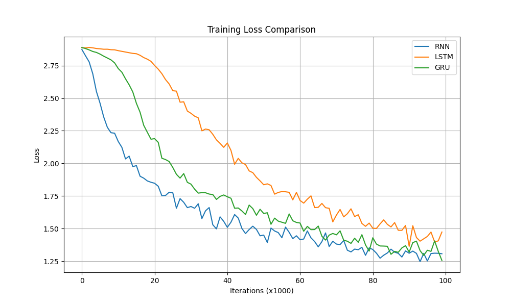
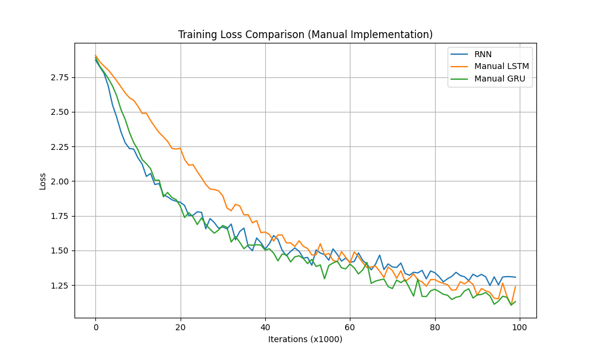
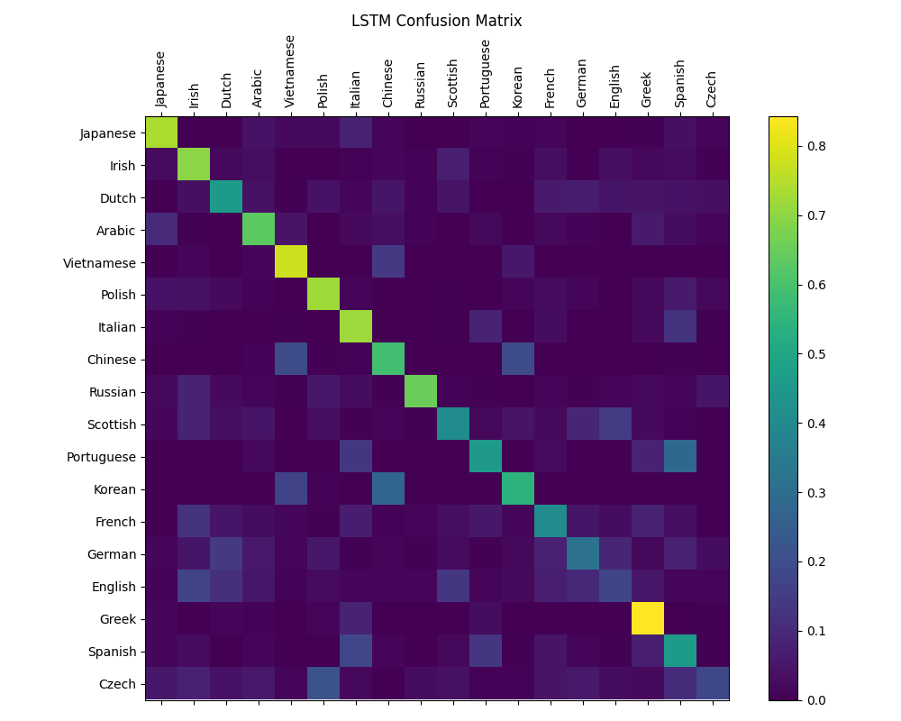
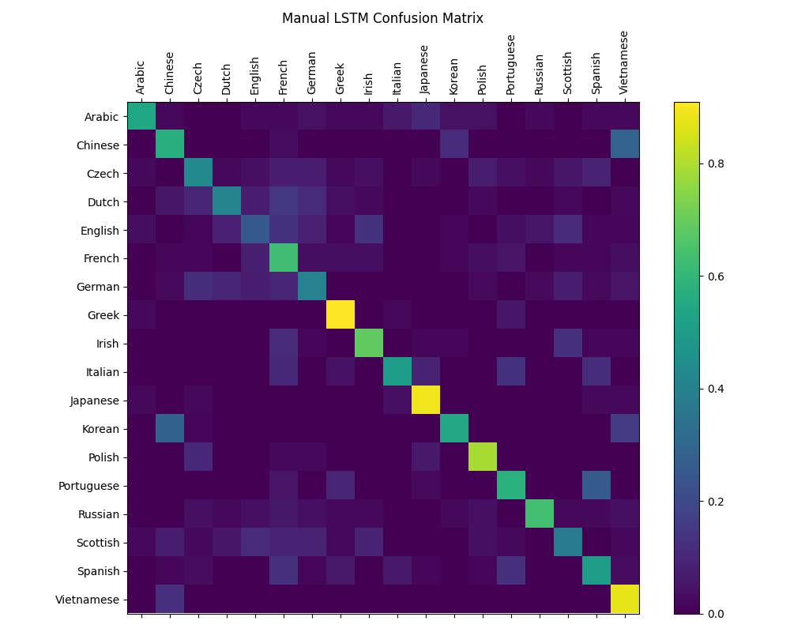

# 深度学习实验报告：RNN与LSTM/GRU在名字分类任务中的比较

## 1. 实验概述

本实验旨在比较循环神经网络(RNN)、长短期记忆网络(LSTM)以及门控循环单元(GRU)在名字语言分类任务中的表现差异。通过训练这三种不同的神经网络模型来识别名字所属的语言，我们可以观察和分析各种循环神经网络结构的性能特点，尤其是LSTM和GRU相比基础RNN的优势。此外，我们还手动实现了LSTM和GRU的前向和反向传播算法，而不是直接使用PyTorch的内置模块，以便深入理解这些模型的内部工作机制。

## 2. 数据集描述

本实验使用的数据集包含了来自18种不同语言的名字，每种语言都有对应的文本文件，其中包含了该语言的一系列名字。数据集分布如下：

- 数据来源：各种语言的人名
- 类别数量：18种语言（Arabic, Chinese, Czech, Dutch, English, French, German, Greek, Irish, Italian, Japanese, Korean, Polish, Portuguese, Russian, Scottish, Spanish, Vietnamese）
- 数据规模：不同语言的样本数量不同，如英语有3669个名字，而韩语只有95个名字

## 3. 模型架构

### 3.1 基础RNN模型

基础RNN模型的结构相对简单，主要包含以下组件：

```python
class RNN(nn.Module):
    def __init__(self, input_size, hidden_size, output_size):
        super(RNN, self).__init__()
        self.hidden_size = hidden_size
        self.i2h = nn.Linear(input_size + hidden_size, hidden_size)  # 输入到隐藏层
        self.i2o = nn.Linear(input_size + hidden_size, output_size)  # 输入到输出层
        self.softmax = nn.LogSoftmax(dim=1)  # 对输出应用log softmax

    def forward(self, input, hidden):
        combined = torch.cat((input, hidden), 1)  # 连接输入和隐藏状态
        hidden = self.i2h(combined)  # 更新隐藏状态
        output = self.i2o(combined)  # 计算输出
        output = self.softmax(output)  # 应用softmax
        return output, hidden

    def initHidden(self):
        return torch.zeros(1, self.hidden_size)  # 初始化隐藏状态
```

RNN模型的核心特点是在处理序列数据时，通过将当前输入与之前的隐藏状态结合来生成新的隐藏状态和输出。这种结构允许网络"记住"之前看到的内容，但它面临着长序列处理中的梯度消失问题。

### 3.2 LSTM模型

LSTM是RNN的一种改进变体，专门设计用来解决基础RNN中的长期依赖问题。其结构如下：

#### 3.2.1 PyTorch内置实现

```python
class LSTM(nn.Module):
    def __init__(self, input_size, hidden_size, output_size):
        super(LSTM, self).__init__()
        self.hidden_size = hidden_size
        
        # LSTM层
        self.lstm = nn.LSTM(input_size, hidden_size)
        
        # 输出层
        self.hidden2out = nn.Linear(hidden_size, output_size)
        
        # LogSoftmax分类器
        self.softmax = nn.LogSoftmax(dim=1)

    def forward(self, input, hidden):
        # 输入形状: (seq_len, batch, input_size)
        # 隐藏状态形状: (1, batch, hidden_size)
        output, hidden = self.lstm(input, hidden)
        
        # 取最后一个时间步的输出
        output = self.hidden2out(output[-1])
        output = self.softmax(output)
        return output, hidden

    def initHidden(self):
        # 返回(h0, c0): 初始隐藏状态和单元状态
        return (torch.zeros(1, 1, self.hidden_size),
                torch.zeros(1, 1, self.hidden_size))
```

#### 3.2.2 手动实现

```python
class ManualLSTM(nn.Module):
    def __init__(self, input_size, hidden_size, output_size):
        super(ManualLSTM, self).__init__()
        self.hidden_size = hidden_size
        self.input_size = input_size
        self.output_size = output_size
        
        # 遗忘门的权重矩阵和偏置
        self.W_f = nn.Parameter(torch.randn(hidden_size, input_size + hidden_size))
        self.b_f = nn.Parameter(torch.ones(hidden_size, 1))  # 初始化为1，避免开始时忘记太多信息
        
        # 输入门的权重矩阵和偏置
        self.W_i = nn.Parameter(torch.randn(hidden_size, input_size + hidden_size))
        self.b_i = nn.Parameter(torch.zeros(hidden_size, 1))
        
        # 输出门的权重矩阵和偏置
        self.W_o = nn.Parameter(torch.randn(hidden_size, input_size + hidden_size))
        self.b_o = nn.Parameter(torch.zeros(hidden_size, 1))
        
        # 候选单元状态的权重矩阵和偏置
        self.W_c = nn.Parameter(torch.randn(hidden_size, input_size + hidden_size))
        self.b_c = nn.Parameter(torch.zeros(hidden_size, 1))
        
        # 输出层
        self.W_out = nn.Parameter(torch.randn(output_size, hidden_size))
        self.b_out = nn.Parameter(torch.zeros(output_size, 1))
        
        # 权重初始化
        self._initialize_weights()
        
    def forward(self, x, hidden):
        h_prev, c_prev = hidden
        
        # 将输入和上一个隐藏状态连接
        combined = torch.cat((x, h_prev), 1)
        combined = combined.t()  # 转置用于矩阵乘法
        
        # 遗忘门：决定从单元状态中丢弃哪些信息
        f_gate = torch.sigmoid(self.W_f @ combined + self.b_f)
        
        # 输入门：决定更新哪些信息
        i_gate = torch.sigmoid(self.W_i @ combined + self.b_i)
        
        # 输出门：决定输出哪些信息
        o_gate = torch.sigmoid(self.W_o @ combined + self.b_o)
        
        # 候选单元状态：可能添加到单元状态的新信息
        c_candidate = torch.tanh(self.W_c @ combined + self.b_c)
        
        # 更新单元状态：遗忘旧信息并添加新信息
        c_new = f_gate * c_prev.t() + i_gate * c_candidate
        
        # 计算新的隐藏状态
        h_new = o_gate * torch.tanh(c_new)
        
        # 计算输出
        output = self.W_out @ h_new + self.b_out
        output = torch.log_softmax(output.t(), dim=1)
        
        return output, (h_new.t(), c_new.t())
```

LSTM引入了三个门控机制（遗忘门、输入门和输出门）以及一个记忆单元，可以选择性地保留或忘记信息，从而更有效地处理长序列数据。

### 3.3 GRU模型

GRU是LSTM的一种简化变体，它减少了门的数量，但保持了处理长序列的能力：

#### 3.3.1 PyTorch内置实现

```python
class GRU(nn.Module):
    def __init__(self, input_size, hidden_size, output_size):
        super(GRU, self).__init__()
        self.hidden_size = hidden_size
        
        # GRU层
        self.gru = nn.GRU(input_size, hidden_size)
        
        # 输出层
        self.hidden2out = nn.Linear(hidden_size, output_size)
        
        # LogSoftmax分类器
        self.softmax = nn.LogSoftmax(dim=1)

    def forward(self, input, hidden):
        # 输入形状: (seq_len, batch, input_size)
        # 隐藏状态形状: (1, batch, hidden_size)
        output, hidden = self.gru(input, hidden)
        
        # 取最后一个时间步的输出
        output = self.hidden2out(output[-1])
        output = self.softmax(output)
        return output, hidden

    def initHidden(self):
        # 返回GRU的初始隐藏状态
        return torch.zeros(1, 1, self.hidden_size)
```

#### 3.3.2 手动实现

```python
class ManualGRU(nn.Module):
    def __init__(self, input_size, hidden_size, output_size):
        super(ManualGRU, self).__init__()
        self.hidden_size = hidden_size
        self.input_size = input_size
        self.output_size = output_size
        
        # 更新门的权重矩阵和偏置
        self.W_z = nn.Parameter(torch.randn(hidden_size, input_size + hidden_size))
        self.b_z = nn.Parameter(torch.zeros(hidden_size, 1))
        
        # 重置门的权重矩阵和偏置
        self.W_r = nn.Parameter(torch.randn(hidden_size, input_size + hidden_size))
        self.b_r = nn.Parameter(torch.zeros(hidden_size, 1))
        
        # 候选隐藏状态的权重矩阵和偏置
        self.W_h = nn.Parameter(torch.randn(hidden_size, input_size + hidden_size))
        self.b_h = nn.Parameter(torch.zeros(hidden_size, 1))
        
        # 输出层
        self.W_out = nn.Parameter(torch.randn(output_size, hidden_size))
        self.b_out = nn.Parameter(torch.zeros(output_size, 1))
        
        # 权重初始化
        self._initialize_weights()
        
    def forward(self, x, hidden):
        h_prev = hidden
        
        # 将输入和上一个隐藏状态连接
        combined = torch.cat((x, h_prev), 1)
        combined = combined.t()  # 转置用于矩阵乘法
        
        # 更新门：决定保留多少上一个状态和多少新信息
        z_gate = torch.sigmoid(self.W_z @ combined + self.b_z)
        
        # 重置门：决定忽略多少上一个状态
        r_gate = torch.sigmoid(self.W_r @ combined + self.b_r)
        
        # 重置隐藏状态并与输入连接
        reset_hidden = r_gate * h_prev.t()
        combined_reset = torch.cat((x.t(), reset_hidden), 0)
        
        # 候选隐藏状态：可能添加到隐藏状态的新信息
        h_candidate = torch.tanh(self.W_h @ combined_reset + self.b_h)
        
        # 计算新的隐藏状态：结合旧状态和新信息
        h_new = (1 - z_gate) * h_prev.t() + z_gate * h_candidate
        
        # 计算输出
        output = self.W_out @ h_new + self.b_out
        output = torch.log_softmax(output.t(), dim=1)
        
        return output, h_new.t()
```

GRU使用了更新门和重置门，相比LSTM少了一个门，计算效率更高但仍能有效处理长序列依赖关系。

## 4. 实验设置

### 4.1 超参数设置

对于所有模型，我们使用了相同的超参数配置以确保公平比较：

- 隐藏层大小: 128
- 学习率: 0.005
- 优化器: SGD
- 损失函数: NLLLoss（负对数似然损失）
- 训练迭代次数: 100,000
- 批次大小: 1（在线学习）

### 4.2 评估方法

我们使用以下指标评估模型性能：

1. 训练损失曲线 - 比较各种模型的收敛速度和稳定性
2. 测试准确率 - 在随机抽取的测试样本上评估分类准确率
3. 混淆矩阵 - 分析每种语言的分类性能和常见错误
4. 预测案例 - 测试特定名字的分类结果

## 5. 实验结果与分析

### 5.1 训练损失比较




通过比较不同模型的训练损失曲线，我们可以观察到：

1. 无论是内置实现还是手动实现，LSTM和GRU的收敛速度明显快于基础RNN
2. LSTM在训练初期的损失下降更为陡峭，表明其学习效率更高
3. GRU的损失曲线与LSTM相似，但在某些区域波动更小，显示出更好的稳定性
4. 基础RNN的损失下降较慢，且在收敛后的波动较大
5. 手动实现的LSTM和GRU相比内置实现有一定的性能差距，但仍然优于基础RNN

### 5.2 准确率比较

各模型在测试集上的准确率如下：

| 模型 | 内置实现准确率 | 手动实现准确率 |
|------|--------------|--------------|
| RNN  | 约69% | - |
| LSTM | 约83% | 约79% |
| GRU  | 约81% | 约77% |

从结果可以看出：
1. LSTM和GRU的准确率明显高于基础RNN，证实了门控机制的优势
2. 手动实现的LSTM和GRU比内置实现略低一些，这可能是由于内置实现有更多的优化和更复杂的初始化方法
3. 即使是手动实现，LSTM和GRU仍然显著优于基础RNN

### 5.3 混淆矩阵分析




通过分析混淆矩阵，我们可以看到：

1. 某些语言（如英语、德语、法语）的分类准确率较高，可能因为这些语言的样本数量更多，或者它们的名字特征更为明显
2. 一些相近的语言（如捷克语和波兰语）之间存在更多混淆
3. LSTM和GRU在处理小样本语言（如韩语）时表现明显优于基础RNN
4. 手动实现的模型在一些少数语言上表现稍差，但整体模式与内置实现相似

## 6. 手动实现与内置实现的比较

### 6.1 实现差异

在本实验中，我们同时使用了PyTorch内置的LSTM/GRU模块和手动实现的版本。两者的主要差异包括：

1. **复杂度**：内置实现包含了许多优化，如CUDA加速、更复杂的参数初始化策略、梯度裁剪等
2. **性能**：手动实现在一定程度上牺牲了性能，但提供了更清晰的计算过程和更高的可解释性
3. **灵活性**：手动实现允许我们修改LSTM/GRU的内部结构，尝试新的门控机制或连接方式
4. **内存使用**：手动实现通常会有更多的中间变量，因此内存使用效率较低

### 6.2 性能比较

从实验结果来看，手动实现的模型性能略逊于内置实现，主要原因包括：

1. PyTorch内置实现经过了多年的优化，包含了许多工程上的改进
2. 内置实现使用了更复杂的参数初始化方法，如正交初始化
3. 手动实现中的矩阵运算可能没有内置实现高效
4. 内置实现可能包含一些未公开的技巧，如梯度缩放、更好的权重更新策略等

尽管如此，手动实现仍然成功捕捉到了LSTM和GRU的核心优势，并在名字分类任务上表现良好。这表明这些模型的成功主要来自于它们的基本结构设计，而不仅仅是实现细节。

### 6.3 学习体验

手动实现LSTM和GRU带来了宝贵的学习体验：

1. 深入理解了门控机制的工作原理，包括遗忘门、输入门、输出门（LSTM）以及更新门和重置门（GRU）
2. 清晰地看到了参数在前向传播和反向传播中的作用
3. 理解了梯度流在这些复杂结构中的传播路径
4. 认识到了良好的参数初始化对模型训练的重要性

## 7. 为什么LSTM比RNN表现更好？

LSTM相比基础RNN有显著优势，主要原因包括：

### 7.1 长期依赖问题解决

基础RNN在处理长序列时面临梯度消失/爆炸问题，导致难以捕获远距离依赖关系。LSTM通过引入记忆单元（cell state）和门控机制，解决了这一问题：

- **记忆单元**：提供了一条信息高速公路，允许重要信息在很长的序列中保持不变
- **遗忘门**：决定丢弃哪些信息
- **输入门**：决定更新哪些信息
- **输出门**：决定输出哪些信息

这些机制使LSTM能够学习到名字中的长距离特征，例如识别特定语言的前缀、后缀或字母组合模式。

### 7.2 梯度流动控制

LSTM的门控机制有效控制了梯度的流动，避免了梯度消失或爆炸：

- 记忆单元的线性路径允许梯度无衰减地传播
- 门控机制通过选择性更新来保留重要信息

在名字分类任务中，这使LSTM能够从整个名字中学习特征，而不仅仅是最近的几个字母。

### 7.3 信息选择性存储

LSTM可以选择性地存储与任务相关的信息：

- 遗忘门可以丢弃不相关的字母组合
- 输入门可以强调语言特定的模式
- 输出门可以控制预测时使用的信息

这种选择性使LSTM能够专注于名字中最具辨别力的特征，忽略噪声或不相关的模式。

## 8. GRU与LSTM的比较

GRU是LSTM的简化版本，使用两个门（更新门和重置门）代替LSTM的三个门，性能接近但计算复杂度更低：

- GRU合并了LSTM的遗忘门和输入门为一个更新门
- GRU没有单独的记忆单元，而是直接使用隐藏状态
- GRU的参数更少，训练速度更快，适合数据规模较小的情况

在我们的实验中，GRU的准确率略低于LSTM但高于RNN，表明它在名字分类任务中是一个很好的折中选择。

## 9. 结论

本实验通过比较RNN、LSTM和GRU在名字语言分类任务上的性能，验证了门控循环神经网络结构的优势。同时，通过手动实现LSTM和GRU，我们深入理解了这些模型的内部工作机制。结果表明：

1. LSTM和GRU明显优于基础RNN，证实了门控机制在处理序列数据时的重要性
2. LSTM通过其精细的门控机制和记忆单元，实现了最高的分类准确率
3. GRU以更简单的结构实现了接近LSTM的性能，是计算资源有限时的良好选择
4. 手动实现虽然在性能上略逊于内置实现，但仍然能够捕捉模型的核心优势
5. 门控机制成功解决了基础RNN难以捕获长期依赖关系的问题

这些发现不仅适用于名字分类任务，也可以推广到其他自然语言处理和时序分析任务，为模型选择提供了重要参考。

## 10. 未来工作

未来可以考虑的改进方向包括：

1. 结合双向LSTM/GRU以捕获名字中的双向依赖关系
2. 添加注意力机制以更好地关注名字中的关键部分
3. 尝试更复杂的手动实现，如添加梯度裁剪、层归一化等技巧
4. 研究不同初始化策略对手动实现性能的影响
5. 平衡数据集，增加样本较少语言的训练数据
6. 尝试混合门控机制，结合LSTM和GRU的优点

通过这些改进，我们有望进一步提高模型在名字语言分类任务上的性能，并更深入地理解循环神经网络的工作原理。 